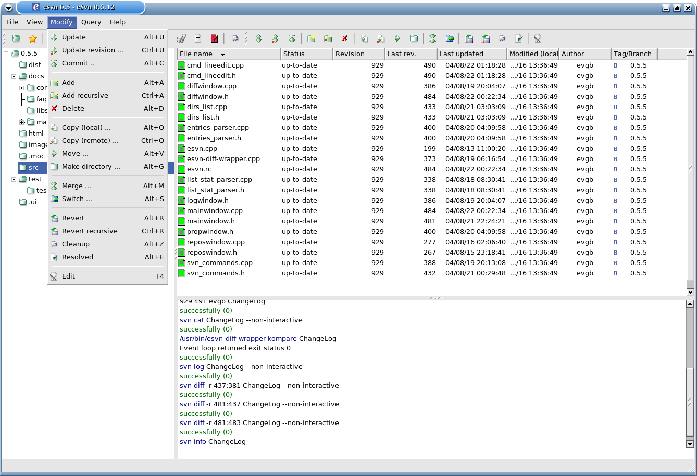
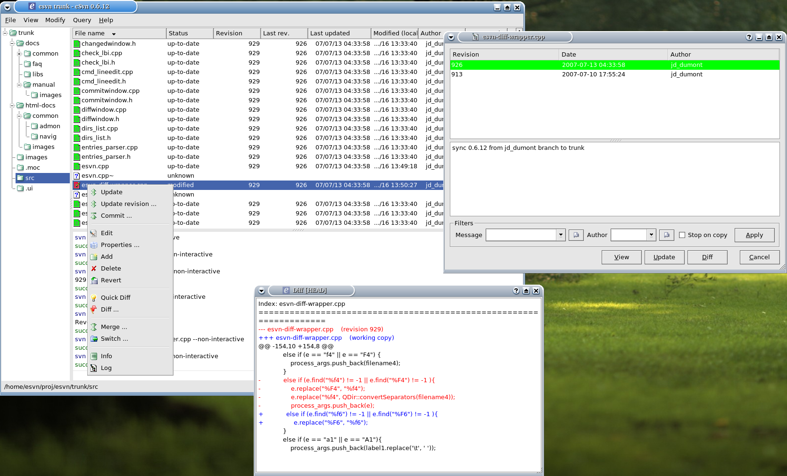

# eSvn - a GUI frontend to the Subversion revision system

_This is the archive of my 15y old project_

## With eSvn you can:

- Checkout, Import, Export, Update, Commit, Add, Delete, Copy, Move, Merge, Switch, Revert, Log, Blame
- Organize your working directory and workspaces
- Browse SVN repository
- Perform Quick Diff, External Diff and 3-way Diff
- Show changed items
- See status of files/directories in real time
- and more ...

_See [html-docs](html_docs) for more details_

## Technical overview

eSvn is cross-platform and runs under Unix-like operating systems (GNU/Linux distributions, FreeBSD, Sun Solaris and others), Mac OS X as well as Windows. The following external softwares are used:

- QT
- Subversion

## Screenshots

### WARNING: This project is **not maintained** anymore, don't bother to send issues or PRs.